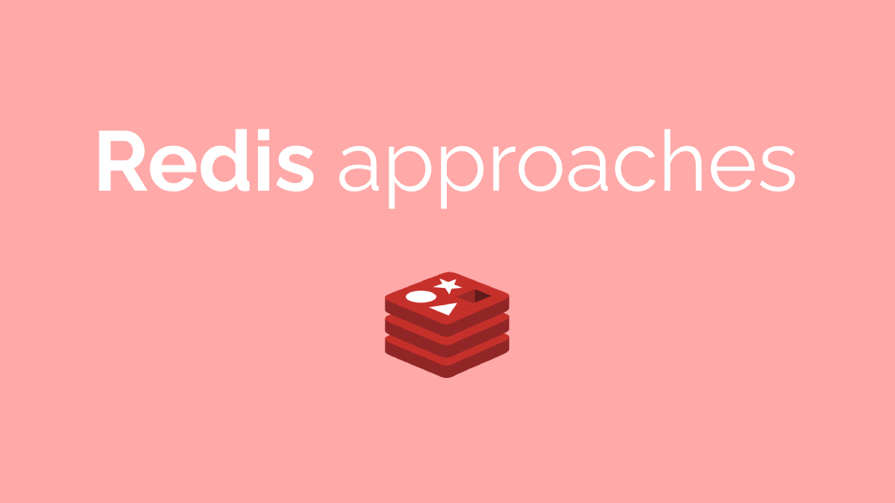

<h1 align="center">
  
</h1>

# The project

Welcome to our open source repository for sharing common usage examples of Redis!

Redis is a popular in-memory data structure store that is widely used as a database, cache, and message broker. It is known for its speed, flexibility, and ease of use.

By providing examples in different languages, we hope to make it easier for developers to get started with Redis and to build high-performance applications that leverage its capabilities.

We invite you to contribute your own examples and to collaborate with other developers in the community. Let's work together to make Redis even more accessible and powerful!

## Philosophy

It's important to acknowledge that while this repository provides a range of solutions for common Redis use cases, it's impossible to cater to the specific needs of every team and project. The examples provided are intended as a starting point, and developers are encouraged to adapt them to their own use cases as needed.

So if you're looking to integrate Redis into your application, we encourage you to explore the examples in this repository and to contribute your own solutions. Let's work together to make Redis more accessible and powerful for everyone.

# Content 
## Approaches list

- [`Cache`](https://github.com/marcosmol204/redis-approaches/blob/main/approaches/cache/cache.md)
## Incoming
- [User session]()
- [Distributed lock]()
- [Counter]()
- [Rate Limiter]()
- [Shopping Cart]()
- [User Retention]()
- [Rank/LeaderBoard/ Top X]()

# Contribution

## Contribution guide
Can be found [here](https://github.com/marcosmol204/redis-approaches/blob/main/CONTRIBUTING.md)

## Core Team

<table width="700px">
  <tr>
      <td align="center"><a href="https://github.com/marcosmol204"> <b>Marcos Molina</b></a> <a href="https://github.com/marcosmol204/redis-approaches/commits?author=marcosmol204" title="Code">💻</a></td>
</tr>
<tr>
 </table>
 
## Contributors

<!-- ALL-CONTRIBUTORS-LIST:START - Do not remove or modify this section -->
<!-- prettier-ignore-start -->
<!-- markdownlint-disable -->
<table>
  <tbody>
    <tr>
      <td align="center" valign="top" width="14.28%"><a href="https://www.linkedin.com/in/yarden-ankonina/"> <b>Yarden Ankonina</b></a> <a href="#content-Yarden-Ankonina" title="Content">🖋</a></td>
    </tr>
  </tbody>
</table>

<!-- markdownlint-restore -->
<!-- prettier-ignore-end -->

<!-- ALL-CONTRIBUTORS-LIST:END -->
